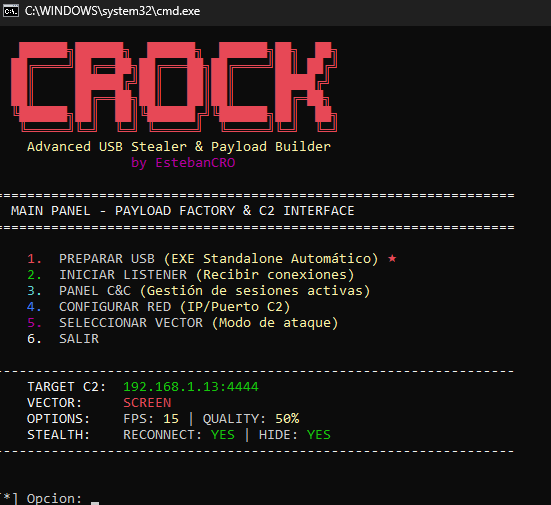

# CROCK v2.0 — USB Remote Access Tool



C2 con cifrado AES-256-CTR. Captura pantalla, keylogger, micrófono y cámara en tiempo real.

---

## Requisitos

- **Python 3.10+** en la máquina C2
- **Windows** en ambos lados (víctima y C2)

---

## Instalación (máquina C2)

1. Abrir la ruta del proyecto:
```powershell
cd C:\Users\USUARIO\Desktop\USB_Crock
```

2. Instalar dependencias:
```powershell
pip install -r requirements.txt
```
*(Si pyaudio falla, instala `pipwin` y luego `pipwin install pyaudio`).*

3. (Opcional) Acelerar cifrado:
```powershell
pip install pycryptodome
```

---

## Arranque

Doble clic en **`run_admin.bat`** (recomendado). 
Desde PowerShell:
```powershell
.\run_admin.bat
```

---

## Uso

1. **Configurar el C2:** Inicia el script, elige opción 1, ingresa tu IP, puerto y selecciona el modo de captura.
2. **Generar el payload:** Elige opción 2. Genera payload para USB o EXE. Se guardarán en la carpeta `output/`.
3. **Escuchar:** Elige opción 3 para levantar el servidor y esperar conexiones.
4. **Ejecutar en la víctima:** Lleva los archivos generados a la máquina destino y ejecútalos.
5. **Ver conexión:** Usa la opción 4 para ver el stream en tiempo real de la víctima.

---

## Notas

- `autorun.inf` no funciona en Windows moderno (bloqueado desde Win7 SP1).
- El payload persiste en ejecución aunque la USB se desconecte.
- Para persistencia, registrar el payload en `HKCU\Software\Microsoft\Windows\CurrentVersion\Run`.
- Los payloads son `.pyw` (ventana oculta), no muestran consola.

---

## Tutorial
[Video Tutorial CROCK](https://drive.google.com/file/d/1sGx5ooZqsAzYdFf74CD2t1mCMI9e-RhV/view?usp=sharing)
